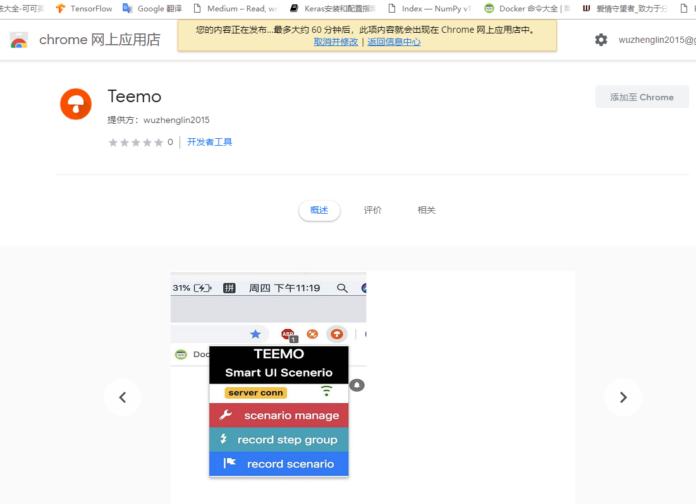

# Teemo教程

视频预览：

## Teemo Smart UI Scenerio

---

Teemo 是一个自动化UI测试生成工具。通过录制用户在浏览器的操作，并提供友好的测试管理面板，可以达到轻松构建高度定制化的测试工程的目的。

注：Teemo针对基于Vue之类框架的单页面应用

Teemo 测试套件由 Chrome拓展以及本地服务程序两部分构成

## 功能点：

---

1. **公用步骤组**：举个例子就如同登录，登录可作为其他测试的基础，这样录制其他测试的时候，可以直接继承这个步骤组，无需重复录制登录过程。这样的好处就是， 如果账号密码更换了，也不至于导致所有测试脚本失效，只需要重新录制该步骤组即可。(注：步骤组可以再继承其他步骤组)
2. **一处录制，到处执行**：在chrome中录制的测试脚本，可以指定在其他浏览器执行，如chrome, firefox, safari, 360, edge, ie。
3. **测试脚本分组管理**：通过测试脚本的命名方式，可以将测试脚本分成不同的分组，执行顺序按文件名字典序执行，执行的时候，可以指定执行某个分组下的全部用例。或者单独指定执行某个用例。当执行多个用例的时候， 可以指定执行完全部才统一报错，还是当遇到一个测试用例报错，立刻终止测试过程。
4. **方便的测试管理UI**：Chrome插件提供了友好的测试管理UI， 可以让用户方便搜索、执行、录制、编辑测试数据。当应用修改，带来某些步骤需要重录， 可以针对这些脚本的某一步重新录制，而无需重新录制整个流程。
5. **支持断言、表达式、提取页面值**：怎么知道测试成功呢？很多时候是通过人肉去辨别某些值是否等于特定的值。比如说订单项的价格总和要等于最终的订单价格。这种需求就可以 通过提取页面值， 进行表达式计算， 再设置断言判断(就是对不上条件就报错)。
6. 支持全局函数：很多时候应用的业务不允许多次执行同样的操作。针对这种需求，可以定义一个生成随机数据的函数，随机生成姓名，手机号等数据。
7. 生成json录制数据，以及编译后的js自动化测试代码：方便有编程基础的测试高效的管理，自定义测试过程。

## 环境安装：

---

下载chrome插件：

[https://chrome.google.com/webstore/detail/teemo/jpldjafpkgmlcmepbaeaifkcfphbjkjn](https://chrome.google.com/webstore/detail/teemo/jpldjafpkgmlcmepbaeaifkcfphbjkjn)

下载服务端：

windows: [https://pan.baidu.com/s/1FyYRa92fEKSZjMu8zJe0RQ](https://pan.baidu.com/s/1FyYRa92fEKSZjMu8zJe0RQ)

Teemo环境：

1. jdk1.8以上java环境
2. nodejs 8以上
3. 如果需要制定浏览器执行，还需要安装对应的浏览器。

- jdk安装教程

    下载地址：[http://www.oracle.com/technetwork/java/javase/downloads/index.html](http://www.oracle.com/technetwork/java/javase/downloads/index.html)

    配置教程：[https://blog.csdn.net/qq_35246620/article/details/61208961](https://blog.csdn.net/qq_35246620/article/details/61208961)

- nodejs安装教程

    [http://www.runoob.com/nodejs/nodejs-install-setup.html](http://www.runoob.com/nodejs/nodejs-install-setup.html)

安装完nodejs后，还需要通过nodejs全局安装mocha测试组件

打开命令行工具,  按住开始键+R windows平台，输入cmd

    //输入以下代码
    npm update  //更新npm仓库，初次安装Node可能需要
    npm install mocha -g //全局安装mocha   mocha是Nodejs的测试组件
    

到此为止，安装过程就完成了。如果遇到问题，可请教你身边的开发人员。

## 如何使用：

---

1. 先启动本地服务

 2. 指定测试工程目录，启动服务

5.打开chrome浏览器，进入你需要测试的单页应用， 点击小蘑菇teemo, 会看到服务连接成功。点击对应的按钮就可以开心的玩耍了！

---

## 子功能介绍

---

**Scenerio Manage**：测试管理面板

**Record Step Group**：录制公用步骤组

**Record Scenerio**：录制测试用例

点击Scenerio Manage可以进入如下页面

因为目前的测试目录并不存在录制数据， 所以这里面还没有东西， 只能看到 **公共步骤组管理** 以及
 **测试管理** 两个按钮， 以及**选择什么浏览器**执行测试按钮， **过滤输入框**，而 **月亮图标** 和 **喇叭图标**
 则代表上面功能点讲过的**两种测试模式**，**静默执行**， 和**一旦错误立刻停止**

## 录制测试用例

---

点击**Record Scenerio**，进行录制测试样例

**页面值提取面板**

点击Save保存后，点击**Scenerio Manage**进入管理面板可以看到如些内容

---

## 使用全局函数

---

进入测试工程目录，可以看到如下内容

进入build文件夹，可以看到有个customGlobalFunc.js的文件

我们在里面写的函数，在整个测试脚本中都可用

使用的例子如下，输入步骤，选择c: code， (t: 静态文本)， 输入函数名

---

## 结束语

---

目前还有挺多css的问题，因为开发的时候是在自己的项目环境上调试的，如果有问题可以自己修改css， css代码就在本地服务文件夹 resources文件夹内，或者到github上提Issue

[https://github.com/wuzhenglin510/teemo_local_server/issues](https://github.com/wuzhenglin510/teemo_local_server/issues)

